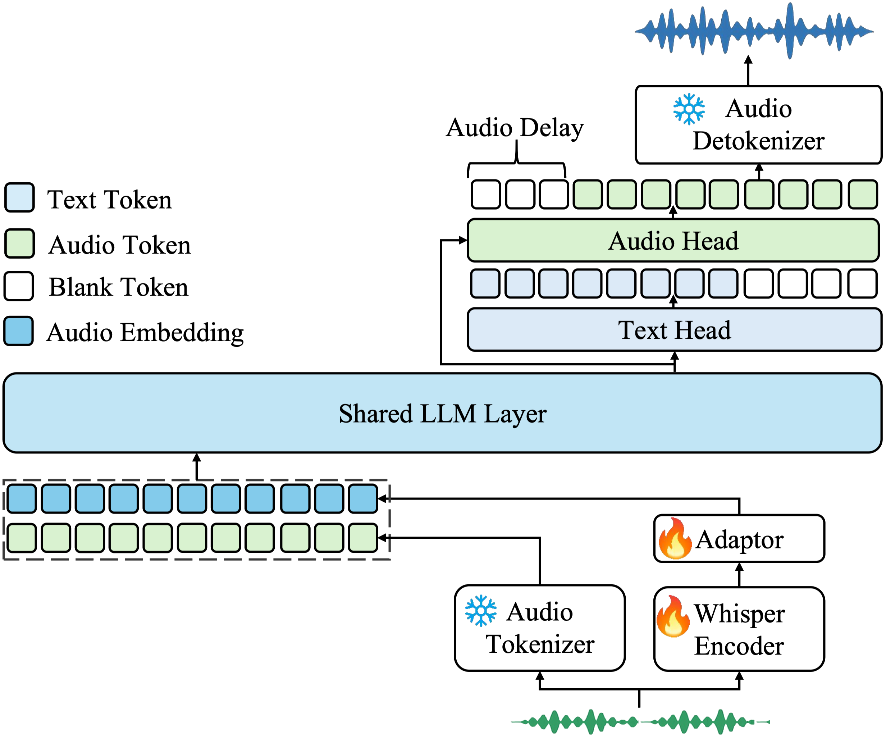
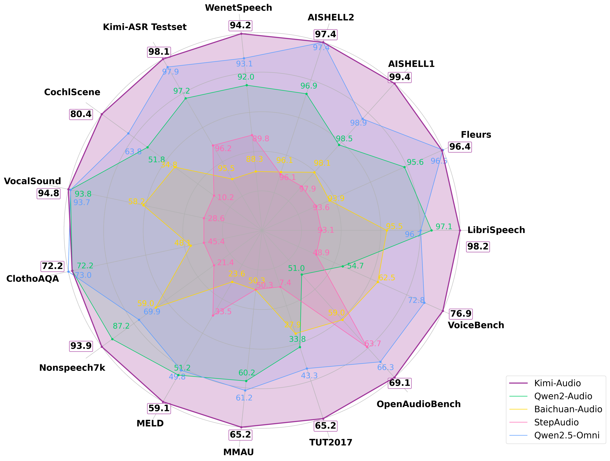

<p align="center">
    
<p>

<p align="center">
Kimi-Audio-7B <a href="https://huggingface.co/moonshotai/Kimi-Audio-7B">🤗</a>&nbsp; | Kimi-Audio-7B-Instruct <a href="https://huggingface.co/moonshotai/Kimi-Audio-7B-Instruct">🤗</a>&nbsp; | 📑 <a href="https://arxiv.org/pdf/2504.18425">Paper</a> &nbsp;&nbsp;
</p>


We present Kimi-Audio, an open-source audio foundation model excelling in **audio understanding, generation, and conversation**. This repository contains the official implementation, models, and evaluation toolkit for Kimi-Audio.

## 🔥🔥🔥 News!!
* May 29, 2025: 👋 We release a finetuning example of [Kimi-Audio-7B](https://github.com/MoonshotAI/Kimi-Audio/tree/master/finetune_codes).
* April 27, 2025: 👋 We release pretrained model weights of [Kimi-Audio-7B](https://huggingface.co/moonshotai/Kimi-Audio-7B).
* April 25, 2025: 👋 We release the inference code and model weights of [Kimi-Audio-7B-Instruct](https://huggingface.co/moonshotai/Kimi-Audio-7B-Instruct).
* April 25, 2025: 👋 We release the audio evaluation toolkit [Kimi-Audio-Evalkit](https://github.com/MoonshotAI/Kimi-Audio-Evalkit). We can easily reproduce the **our results and baselines** by this toolkit!
* April 25, 2025: 👋 We release the technical report of [Kimi-Audio](https://arxiv.org/pdf/2504.18425).

## Table of Contents

- [Introduction](#introduction)
- [Architecture Overview](#architecture-overview)
- [Quick Start](#quick-start)
- [Evaluation](#evaluation)
  - [Speech Recognition](#automatic-speech-recognition-asr)
  - [Audio Understanding](#audio-understanding)
  - [Audio-to-Text Chat](#audio-to-text-chat)
  - [Speech Conversation](#speech-conversation)
- [Finetune](#finetune)
- [Evaluation Toolkit](#evaluation-toolkit)
- [Generation Testset](#generation-testset)
- [License](#license)
- [Acknowledgements](#acknowledgements)
- [Citation](#citation)
- [Contact Us](#contact-us)

## Introduction

Kimi-Audio is designed as a universal audio foundation model capable of handling a wide variety of audio processing tasks within a single unified framework. Key features include:

*   **Universal Capabilities:** Handle diverse tasks like automatic speech recognition (ASR), audio question answering (AQA), automatic audio captioning (AAC), speech emotion recognition (SER), sound event/scene classification (SEC/ASC), and end-to-end speech conversation.
*   **State-of-the-Art Performance:** Achieve SOTA results on numerous audio benchmarks (see [Evaluation](#evaluation) and the [Technical Report](https://arxiv.org/pdf/2504.18425)).
*   **Large-Scale Pre-training:** Pre-train on over 13 million hours of diverse audio data (speech, music, sounds) and text data, enabling robust audio reasoning and language understanding.
*   **Novel Architecture:** Employ a hybrid audio input (continuous acoustic vectors + discrete semantic tokens) and an LLM core with parallel heads for text and audio token generation.
*   **Efficient Inference:** Feature a chunk-wise streaming detokenizer based on flow matching for low-latency audio generation.
*   **Open-Source:** Release the code and model checkpoints for both pre-training and instruction fine-tuning, and release a comprehensive evaluation toolkit to foster community research and development.

## Architecture Overview

<p align="center">
    
<p>

Kimi-Audio consists of three main components:

1.  **Audio Tokenizer:** Converts input audio into:
    *   Discrete semantic tokens (12.5Hz) using vector quantization.
    *   Continuous acoustic features derived from a Whisper encoder (downsampled to 12.5Hz).
2.  **Audio LLM:** A transformer-based model (initialized from a pre-trained text LLM like Qwen 2.5 7B) with shared layers processing multimodal inputs, followed by parallel heads for autoregressively generating text tokens and discrete audio semantic tokens.
3.  **Audio Detokenizer:** Converts the predicted discrete semantic audio tokens back into high-fidelity waveforms using a flow-matching model and a vocoder (BigVGAN), supporting chunk-wise streaming with a look-ahead mechanism for low latency.

## Getting Started

### Step1: Get the Code

```bash
git clone https://github.com/MoonshotAI/Kimi-Audio.git
cd Kimi-Audio
git submodule update --init --recursive
pip install -r requirements.txt
```

Kimi‑Audio can now be installed directly via **pip**.
```bash
pip install torch
pip install git+https://github.com/MoonshotAI/Kimi-Audio.git
```

## Quick Start

This example demonstrates basic usage for generating text from audio (ASR) and generating both text and speech in a conversational turn.

```python
import soundfile as sf
from kimia_infer.api.kimia import KimiAudio

# --- 1. Load Model ---
model_path = "moonshotai/Kimi-Audio-7B-Instruct" 
model = KimiAudio(model_path=model_path, load_detokenizer=True)

# --- 2. Define Sampling Parameters ---
sampling_params = {
    "audio_temperature": 0.8,
    "audio_top_k": 10,
    "text_temperature": 0.0,
    "text_top_k": 5,
    "audio_repetition_penalty": 1.0,
    "audio_repetition_window_size": 64,
    "text_repetition_penalty": 1.0,
    "text_repetition_window_size": 16,
}

# --- 3. Example 1: Audio-to-Text (ASR) ---
messages_asr = [
    # You can provide context or instructions as text
    {"role": "user", "message_type": "text", "content": "Please transcribe the following audio:"},
    # Provide the audio file path
    {"role": "user", "message_type": "audio", "content": "test_audios/asr_example.wav"}
]

# Generate only text output
_, text_output = model.generate(messages_asr, **sampling_params, output_type="text")
print(">>> ASR Output Text: ", text_output) # Expected output: "这并不是告别，这是一个篇章的结束，也是新篇章的开始。"


# --- 4. Example 2: Audio-to-Audio/Text Conversation ---
messages_conversation = [
    # Start conversation with an audio query
    {"role": "user", "message_type": "audio", "content": "test_audios/qa_example.wav"}
]

# Generate both audio and text output
wav_output, text_output = model.generate(messages_conversation, **sampling_params, output_type="both")

# Save the generated audio
output_audio_path = "output_audio.wav"
sf.write(output_audio_path, wav_output.detach().cpu().view(-1).numpy(), 24000) # Assuming 24kHz output
print(f">>> Conversational Output Audio saved to: {output_audio_path}")
print(">>> Conversational Output Text: ", text_output) # Expected output: "当然可以，这很简单。一二三四五六七八九十。"

# --- 5. Example 3: Audio-to-Audio/Text Conversation with Multiturn ---

messages = [
    {"role": "user", "message_type": "audio", "content": "test_audios/multiturn/case2/multiturn_q1.wav"},
    # This is the first turn output of Kimi-Audio
    {"role": "assistant", "message_type": "audio-text", "content": ["test_audios/multiturn/case2/multiturn_a1.wav", "当然可以，这很简单。一二三四五六七八九十。"]},
    {"role": "user", "message_type": "audio", "content": "test_audios/multiturn/case2/multiturn_q2.wav"}
]
wav, text = model.generate(messages, **sampling_params, output_type="both")


# Generate both audio and text output
wav_output, text_output = model.generate(messages_conversation, **sampling_params, output_type="both")

# Save the generated audio
output_audio_path = "output_audio.wav"
sf.write(output_audio_path, wav_output.detach().cpu().view(-1).numpy(), 24000) # Assuming 24kHz output
print(f">>> Conversational Output Audio saved to: {output_audio_path}")
print(">>> Conversational Output Text: ", text_output) # Expected output: "没问题，继续数下去就是十一十二十三十四十五十六十七十八十九二十。"

print("Kimi-Audio inference examples complete.")


```

## Evaluation

Kimi-Audio achieves state-of-the-art (SOTA) performance across a wide range of audio benchmarks. 

The below is the overall performance:
<p align="center">
    
<p>


Here are performances on different benchmarks, you can easily reproduce the **our results and baselines** by our [Kimi-Audio-Evalkit](https://github.com/MoonshotAI/Kimi-Audio-Evalkit) (also see [**Evaluation Toolkit**](#evaluation-toolkit)):

### Automatic Speech Recognition (ASR)
<table>
  <thead>
    <tr>
      <th>Datasets</th>
      <th>Model</th>
      <th>Performance (WER&darr;)</th>
    </tr>
  </thead>
  <tbody>
    <tr>
      <td rowspan="5"><strong>LibriSpeech</strong><br>test-clean | test-other</td>
      <td>Qwen2-Audio-base</td>
      <td>1.74 | 4.04</td>
    </tr>
    <tr>
      <td>Baichuan-base</td>
      <td>3.02 | 6.04</td>
    </tr>
    <tr>
      <td>Step-Audio-chat</td>
      <td>3.19 | 10.67</td>
    </tr>
    <tr>
      <td>Qwen2.5-Omni</td>
      <td>2.37 | 4.21</td>
    </tr>
    <tr>
      <td>Kimi-Audio</td>
      <td><strong>1.28</strong> | <strong>2.42</strong></td>
    </tr>
    <tr>
      <td rowspan="5"><strong>Fleurs</strong><br>zh | en</td>
      <td>Qwen2-Audio-base</td>
      <td>3.63 | 5.20</td>
    </tr>
    <tr>
      <td>Baichuan-base</td>
      <td>4.15 | 8.07</td>
    </tr>
    <tr>
      <td>Step-Audio-chat</td>
      <td>4.26 | 8.56</td>
    </tr>
    <tr>
      <td>Qwen2.5-Omni</td>
      <td>2.92 | <strong>4.17</strong></td>
    </tr>
    <tr>
      <td>Kimi-Audio</td>
      <td><strong>2.69</strong> | 4.44</td>
    </tr>
    <tr>
      <td rowspan="5"><strong>AISHELL-1</strong></td>
      <td>Qwen2-Audio-base</td>
      <td>1.52</td>
    </tr>
    <tr>
      <td>Baichuan-base</td>
      <td>1.93</td>
    </tr>
    <tr>
      <td>Step-Audio-chat</td>
      <td>2.14</td>
    </tr>
    <tr>
      <td>Qwen2.5-Omni</td>
      <td>1.13</td>
    </tr>
    <tr>
      <td>Kimi-Audio</td>
      <td><strong>0.60</strong></td>
    </tr>
    <tr>
      <td rowspan="5"><strong>AISHELL-2</strong> ios</td>
      <td>Qwen2-Audio-base</td>
      <td>3.08</td>
    </tr>
    <tr>
      <td>Baichuan-base</td>
      <td>3.87</td>
    </tr>
    <tr>
      <td>Step-Audio-chat</td>
      <td>3.89</td>
    </tr>
    <tr>
      <td>Qwen2.5-Omni</td>
      <td><strong>2.56</strong></td>
    </tr>
    <tr>
      <td>Kimi-Audio</td>
      <td><strong>2.56</strong></td>
    </tr>
    <tr>
      <td rowspan="5"><strong>WenetSpeech</strong><br>test-meeting | test-net</td>
      <td>Qwen2-Audio-base</td>
      <td>8.40 | 7.64</td>
    </tr>
    <tr>
      <td>Baichuan-base</td>
      <td>13.28 | 10.13</td>
    </tr>
    <tr>
      <td>Step-Audio-chat</td>
      <td>10.83 | 9.47</td>
    </tr>
    <tr>
      <td>Qwen2.5-Omni</td>
      <td>7.71 | 6.04</td>
    </tr>
    <tr>
      <td>Kimi-Audio</td>
      <td><strong>6.28</strong> | <strong>5.37</strong></td>
    </tr>
    <tr>
      <td rowspan="5"><strong>Kimi-ASR Internal Testset</strong><br>subset1 | subset2</td>
      <td>Qwen2-Audio-base</td>
      <td>2.31 | 3.24</td>
    </tr>
    <tr>
      <td>Baichuan-base</td>
      <td>3.41 | 5.60</td>
    </tr>
    <tr>
      <td>Step-Audio-chat</td>
      <td>2.82 | 4.74</td>
    </tr>
    <tr>
      <td>Qwen2.5-Omni</td>
      <td>1.53 | 2.68</td>
    </tr>
    <tr>
      <td>Kimi-Audio</td>
      <td><strong>1.42</strong> | <strong>2.44</strong></td>
    </tr>
  </tbody>
</table>

### Audio Understanding
<table>
  <thead>
    <tr>
      <th>Datasets</th>
      <th>Model</th>
      <th>Performance&uparrow;</th>
    </tr>
  </thead>
  <tbody>
    <tr>
      <td rowspan="6"><strong>MMAU</strong><br>music | sound | speech</td>
      <td>Qwen2-Audio-base</td>
      <td>58.98 | 69.07 | 52.55</td>
    </tr>
    <tr>
      <td>Baichuan-chat</td>
      <td>49.10 | 59.46 | 42.47</td>
    </tr>
    <tr>
      <td>GLM-4-Voice</td>
      <td>38.92 | 43.54 | 32.43</td>
    </tr>
    <tr>
      <td>Step-Audio-chat</td>
      <td>49.40 | 53.75 | 47.75</td>
    </tr>
    <tr>
      <td>Qwen2.5-Omni</td>
      <td><strong>62.16</strong> | 67.57 | 53.92</td>
    </tr>
    <tr>
      <td>Kimi-Audio</td>
      <td>61.68 | <strong>73.27</strong> | <strong>60.66</strong></td>
    </tr>
    <tr>
      <td rowspan="5"><strong>ClothoAQA</strong><br>test | dev</td>
      <td>Qwen2-Audio-base</td>
      <td>71.73 | 72.63</td>
    </tr>
    <tr>
      <td>Baichuan-chat</td>
      <td>48.02 | 48.16</td>
    </tr>
    <tr>
      <td>Step-Audio-chat</td>
      <td>45.84 | 44.98</td>
    </tr>
    <tr>
      <td>Qwen2.5-Omni</td>
      <td><strong>72.86</strong> | 73.12</td>
    </tr>
    <tr>
      <td>Kimi-Audio</td>
      <td>71.24 | <strong>73.18</strong></td>
    </tr>
    <tr>
      <td rowspan="5"><strong>VocalSound</strong></td>
      <td>Qwen2-Audio-base</td>
      <td>93.82</td>
    </tr>
    <tr>
      <td>Baichuan-base</td>
      <td>58.17</td>
    </tr>
    <tr>
      <td>Step-Audio-chat</td>
      <td>28.58</td>
    </tr>
    <tr>
      <td>Qwen2.5-Omni</td>
      <td>93.73</td>
    </tr>
    <tr>
      <td>Kimi-Audio</td>
      <td><strong>94.85</strong></td>
    </tr>
    <tr>
      <td rowspan="5"><strong>Nonspeech7k</strong></td>
      <td>Qwen2-Audio-base</td>
      <td>87.17</td>
    </tr>
    <tr>
      <td>Baichuan-chat</td>
      <td>59.03</td>
    </tr>
    <tr>
      <td>Step-Audio-chat</td>
      <td>21.38</td>
    </tr>
    <tr>
      <td>Qwen2.5-Omni</td>
      <td>69.89</td>
    </tr>
    <tr>
      <td>Kimi-Audio</td>
      <td><strong>93.93</strong></td>
    </tr>
    <tr>
      <td rowspan="5"><strong>MELD</strong></td>
      <td>Qwen2-Audio-base</td>
      <td>51.23</td>
    </tr>
    <tr>
      <td>Baichuan-chat</td>
      <td>23.59</td>
    </tr>
    <tr>
      <td>Step-Audio-chat</td>
      <td>33.54</td>
    </tr>
    <tr>
      <td>Qwen2.5-Omni</td>
      <td>49.83</td>
    </tr>
    <tr>
      <td>Kimi-Audio</td>
      <td><strong>59.13</strong></td>
    </tr>
    <tr>
      <td rowspan="5"><strong>TUT2017</strong></td>
      <td>Qwen2-Audio-base</td>
      <td>33.83</td>
    </tr>
    <tr>
      <td>Baichuan-base</td>
      <td>27.9</td>
    </tr>
    <tr>
      <td>Step-Audio-chat</td>
      <td>7.41</td>
    </tr>
    <tr>
      <td>Qwen2.5-Omni</td>
      <td>43.27</td>
    </tr>
    <tr>
      <td>Kimi-Audio</td>
      <td><strong>65.25</strong></td>
    </tr>
    <tr>
      <td rowspan="5"><strong>CochlScene</strong><br>test | dev</td>
      <td>Qwen2-Audio-base</td>
      <td>52.69 | 50.96</td>
    </tr>
    <tr>
      <td>Baichuan-base</td>
      <td>34.93 | 34.56</td>
    </tr>
    <tr>
      <td>Step-Audio-chat</td>
      <td>10.06 | 10.42</td>
    </tr>
    <tr>
      <td>Qwen2.5-Omni</td>
      <td>63.82 | 63.82</td>
    </tr>
    <tr>
      <td>Kimi-Audio</td>
      <td><strong>79.84</strong> | <strong>80.99</strong></td>
    </tr>
  </tbody>
</table>

### Audio-to-Text Chat

<table>
  <thead>
    <tr>
      <th>Datasets</th>
      <th>Model</th>
      <th>Performance↑</th>
    </tr>
  </thead>
  <tbody>
    <tr>
      <td rowspan="6"><b>OpenAudioBench</b><br>AlpacaEval | Llama Questions |<br>Reasoning QA | TriviaQA | Web Questions</td>
      <td>Qwen2-Audio-chat</td>
      <td>57.19 | 69.67 | 42.77 | 40.30 | 45.20</td>
    </tr>
    <tr>
      <td>Baichuan-chat</td>
      <td>59.65 | 74.33 | 46.73 | 55.40 | 58.70</td>
    </tr>
    <tr>
      <td>GLM-4-Voice</td>
      <td>57.89 | 76.00 | 47.43 | 51.80 | 55.40</td>
    </tr>
    <tr>
      <td>StepAudio-chat</td>
      <td>56.53 | 72.33 | 60.00 | 56.80 | <b>73.00</b></td>
    </tr>
    <tr>
      <td>Qwen2.5-Omni</td>
      <td>72.76 | 75.33 | <b>63.76</b> | 57.06 | 62.80</td>
    </tr>
    <tr>
      <td>Kimi-Audio</td>
      <td><b>75.73</b> | <b>79.33</b> | 58.02 | <b>62.10</b> | 70.20</td>
    </tr>
    <tr>
      <td rowspan="6"><b>VoiceBench</b><br>AlpacaEval | CommonEval |<br>SD-QA | MMSU</td>
      <td>Qwen2-Audio-chat</td>
      <td>3.69 | 3.40 | 35.35 | 35.43</td>
    </tr>
    <tr>
      <td>Baichuan-chat</td>
      <td>4.00 | 3.39 | 49.64 | 48.80</td>
    </tr>
    <tr>
      <td>GLM-4-Voice</td>
      <td>4.06 | 3.48 | 43.31 | 40.11</td>
    </tr>
    <tr>
      <td>StepAudio-chat</td>
      <td>3.99 | 2.99 | 46.84 | 28.72</td>
    </tr>
    <tr>
      <td>Qwen2.5-Omni</td>
      <td>4.33 | 3.84 | 57.41 | 56.38</td>
    </tr>
    <tr>
      <td>Kimi-Audio</td>
      <td><b>4.46</b> | <b>3.97</b> | <b>63.12</b> | <b>62.17</b></td>
    </tr>
    <tr>
      <td rowspan="6"><b>VoiceBench</b><br>OpenBookQA | IFEval |<br>AdvBench | Avg</td>
      <td>Qwen2-Audio-chat</td>
      <td>49.01 | 22.57 | 98.85 | 54.72</td>
    </tr>
    <tr>
      <td>Baichuan-chat</td>
      <td>63.30 | 41.32 | 86.73 | 62.51</td>
    </tr>
    <tr>
      <td>GLM-4-Voice</td>
      <td>52.97 | 24.91 | 88.08 | 57.17</td>
    </tr>
    <tr>
      <td>StepAudio-chat</td>
      <td>31.87 | 29.19 | 65.77 | 48.86</td>
    </tr>
    <tr>
      <td>Qwen2.5-Omni</td>
      <td>79.12 | 53.88 | 99.62 | 72.83</td>
    </tr>
    <tr>
      <td>Kimi-Audio</td>
      <td><b>83.52</b> | <b>61.10</b> | <b>100.00</b> | <b>76.93</b></td>
    </tr>
  </tbody>
</table>

### Speech Conversation
<table>
  <caption>Performance of Kimi-Audio and baseline models on speech conversation.</caption>
  <thead>
    <tr>
      <th rowspan="2">Model</th>
      <th colspan="6">Ability</th>
    </tr>
    <tr>
      <th>Speed Control</th>
      <th>Accent Control</th>
      <th>Emotion Control</th>
      <th>Empathy</th>
      <th>Style Control</th>
      <th>Avg</th>
    </tr>
  </thead>
  <tbody>
    <tr>
      <td>GPT-4o</td>
      <td>4.21</td>
      <td><strong>3.65</strong></td>
      <td>4.05</td>
      <td><strong>3.87</strong></td>
      <td><strong>4.54</strong></td>
      <td><strong>4.06</strong></td>
    </tr>
    <tr>
      <td>Step-Audio-chat</td>
      <td>3.25</td>
      <td>2.87</td>
      <td>3.33</td>
      <td>3.05</td>
      <td>4.14</td>
      <td>3.33</td>
    </tr>
    <tr>
      <td>GLM-4-Voice</td>
      <td>3.83</td>
      <td>3.51</td>
      <td>3.77</td>
      <td>3.07</td>
      <td>4.04</td>
      <td>3.65</td>
    </tr>
    <tr>
      <td>GPT-4o-mini</td>
      <td>3.15</td>
      <td>2.71</td>
      <td>4.24</td>
      <td>3.16</td>
      <td>4.01</td>
      <td>3.45</td>
    </tr>
    <tr>
      <td>Kimi-Audio</td>
      <td><strong>4.30</strong></td>
      <td>3.45</td>
      <td><strong>4.27</strong></td>
      <td>3.39</td>
      <td>4.09</td>
      <td>3.90</td>
    </tr>
  </tbody>
</table>

## Finetune

We release the pre-trained model and the lightweight finetune codes. Please refer to the [finetune_codes/README.md](finetune_codes/README.md) for more details.

## Evaluation Toolkit

Evaluating and comparing audio foundation models is challenging due to inconsistent metrics, varying inference configurations, and a lack of standardized generation evaluation. To address this, we developed and open-sourced an **Evaluation Toolkit**.

Key features:
*   Integrates Kimi-Audio and other recent audio LLMs.
*   Implements standardized metric calculation and integrates LLMs for intelligent judging (e.g., for AQA).
*   Provides a unified platform for side-by-side comparisons with shareable inference 'recipes' for reproducibility.
*   Includes a benchmark for evaluating speech conversation abilities (control, empathy, style).

We encourage the community to use and contribute to this toolkit to foster more reliable and comparable benchmarking. Find it here: [Kimi-Audio-Evalkit](https://github.com/MoonshotAI/Kimi-Audio-Evalkit).

## Generation Testset

We collect and release [Kimi-Audio-Generation-Testset](https://huggingface.co/datasets/moonshotai/Kimi-Audio-GenTest), which is designed to benchmark and evaluate the conversational capabilities of audio-based dialogue models. It consists of a collection of audio files containing various instructions and conversational prompts. The primary goal is to assess a model's ability to generate not just relevant, but also appropriately styled audio responses. The language in dataset is Chinese.

## License

The model is based and modified from [Qwen 2.5-7B](https://github.com/QwenLM/Qwen2.5). Code derived from Qwen2.5-7B is licensed under the [Apache 2.0 License](https://www.apache.org/licenses/LICENSE-2.0). Other parts of the code are licensed under the [MIT License](https://opensource.org/licenses/MIT).


## Acknowledgements

We would like to thank the following projects and individuals for their contributions to the development of Kimi-Audio:

* [Whisper](https://github.com/openai/whisper)
* [Transformers](https://github.com/huggingface/transformers)
* [BigVGAN](https://github.com/NVIDIA/BigVGAN)
* [GLM-4-Voice](https://github.com/THUDM/GLM-4-Voice)
* [Qwen](https://github.com/QwenLM/Qwen/tree/main)

Thank you to all the open-source projects for their contributions to this project!


## Citation

If you find Kimi-Audio useful in your research or applications, please cite our technical report:

```bibtex
@misc{kimiteam2025kimiaudiotechnicalreport,
      title={Kimi-Audio Technical Report}, 
      author={KimiTeam and Ding Ding and Zeqian Ju and Yichong Leng and Songxiang Liu and Tong Liu and Zeyu Shang and Kai Shen and Wei Song and Xu Tan and Heyi Tang and Zhengtao Wang and Chu Wei and Yifei Xin and Xinran Xu and Jianwei Yu and Yutao Zhang and Xinyu Zhou and Y. Charles and Jun Chen and Yanru Chen and Yulun Du and Weiran He and Zhenxing Hu and Guokun Lai and Qingcheng Li and Yangyang Liu and Weidong Sun and Jianzhou Wang and Yuzhi Wang and Yuefeng Wu and Yuxin Wu and Dongchao Yang and Hao Yang and Ying Yang and Zhilin Yang and Aoxiong Yin and Ruibin Yuan and Yutong Zhang and Zaida Zhou},
      year={2025},
      eprint={2504.18425},
      archivePrefix={arXiv},
      primaryClass={eess.AS},
      url={https://arxiv.org/abs/2504.18425}, 
}
```

## Contact Us

For questions, issues, or collaboration inquiries, please feel free to open an issue on GitHub.
